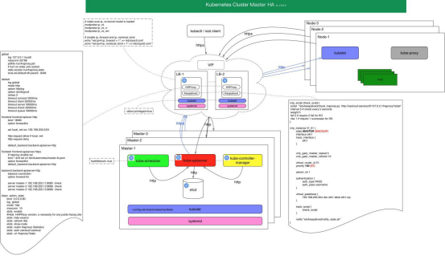

# Kubernetes1.10.3离线部署安装说明文档

 K8S集群部署有几种方式：`kubeadm`、`minikube`和二进制包。前两者属于自动部署，简化部署操作，但不适用与生产环境部署。
## 高可用简介
   在`Kubernetes`体系中，`Master`服务扮演着总控中心的角色，主要的三个服务：
`kube-apiserver`、`kube-controller-mansger`和`kube-scheduler`。
    通过不断与工作节点上的`Kubelet`和`kube-proxy`进行通信来维护整个集群的健康工作状态。如果`Master`的服务无法访问到某个`Node`，则会将该`Node`标记为不可用，不再向其调度新建的Pod。但对`Master`自身则需要进行额外的监控，使`Master`不成为集群的单故障点，所以对`Master`服务也需要进行高可用方式的部署。
以`Master`的`kube-apiserver`、`kube-controller-mansger`和`kube-scheduler`三个服务作为一个部署单元，类似于`etcd`集群的典型部署配置。使用至少三台服务器安装`Master`服务，并且使用`Active-Standby-Standby`模式，保证任何时候总有一套Master能够正常工作。
## HA原理
所有工作节点上的`Kubelet`和`kube-proxy`服务则需要访问`Master`集群的统一访问入口地址。下图展示了一种典型的部署方式。
 