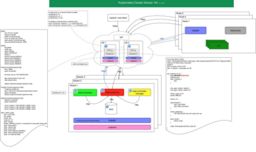

# Kubernetes1.10.3离线部署安装说明文档

 K8S集群部署有几种方式：`kubeadm`、`minikube`和二进制包。前两者属于自动部署，简化部署操作，但不适用与生产环境部署。
## 高可用简介
   在`Kubernetes`体系中，`Master`服务扮演着总控中心的角色，主要的三个服务：
`kube-apiserver`、`kube-controller-mansger`和`kube-scheduler`。
    通过不断与工作节点上的`Kubelet`和`kube-proxy`进行通信来维护整个集群的健康工作状态。如果`Master`的服务无法访问到某个`Node`，则会将该`Node`标记为不可用，不再向其调度新建的Pod。但对`Master`自身则需要进行额外的监控，使`Master`不成为集群的单故障点，所以对`Master`服务也需要进行高可用方式的部署。
以`Master`的`kube-apiserver`、`kube-controller-mansger`和`kube-scheduler`三个服务作为一个部署单元，类似于`etcd`集群的典型部署配置。使用至少三台服务器安装`Master`服务，并且使用`Active-Standby-Standby`模式，保证任何时候总有一套Master能够正常工作。
## HA原理
所有工作节点上的`Kubelet`和`kube-proxy`服务则需要访问`Master`集群的统一访问入口地址。下图展示了一种典型的部署方式。

#### 配置说明：
1、所有组件可以通过`kubelet static pod`的方式启动和管理，由`kubelet static pod`机制保证宿主机上各个组件的高可用, 注意`kubelet`要添加配置`--allow-privileged=true`;

2、管理`static pod`的`kubelet`的高可用通过`systemd`来负责；

3、当然，你也可以直接通过进程来部署这些组件，`systemd`来直接管理这些进程；（我们选择的是这种方式，降低复杂度。）

4、上图中，`etcd`和`Master`部署在一起，三个`Master`节点分别部署了三个`etcd`，这三个`etcd`组成一个集群；（当然，如果条件允许，建议将`etcd`集群和`Master`节点分开部署。）

5、每个`Master`中的`apiserver`、`controller-manager`、`scheduler`都使用`hostNetwork`,`controller-manager`和`scheduler`通过`localhost`连接到本节点的`apiserver`，而不会和其他两个`Master`节点的`apiserver`连接；

6、外部的`rest-client`、`kubectl`、`kubelet`、`kube-proxy`等都通过`TLS`证书，在`LB`节点做`TLS Termination`，`LB`出来就是`http`请求发到经过LB策略`（RR）`到对应的`apiserver instance`；

7、`apiserver`到`kubelet server`和`kube-proxy server`的访问也类似，`Https`到`LB`这里做`TLS Termination`，然后`http`请求出来到对应`node`的`kubelet`/`kube-proxy server`；

8、`apiserver`的`HA`通过经典的`haproxy + keepalived`来保证，集群对外暴露`VIP`；

9、`controller-manager`和`scheduler`的`HA`通过自身提供的`leader`选举功能`（--leader-select=true）`，使得3个`controller-manager`和`scheduler`都分别只有一个是`leader`，`leader`处于正常工作状态，当`leader`失败，会重新选举新`leader`来顶替继续工作；

因此，该HA方案中，通过`haproxy+keepalived`来做`apiserver`的`LB`和`HA`，`controller-manager`和`scheduler`通过自身的`leader`选举来达到`HA`，`etcd`通过`raft`协议保证`etcd cluster`数据的一致性，达到`HA`；

**注意：**`LB`所在的节点，注意确保`ip_vs model`已加载、`ip_forward`和`ip_nonlocal_bind`已开启；

当然上图内部结构太过复杂，难以理解。简化后的架构如下所示：
